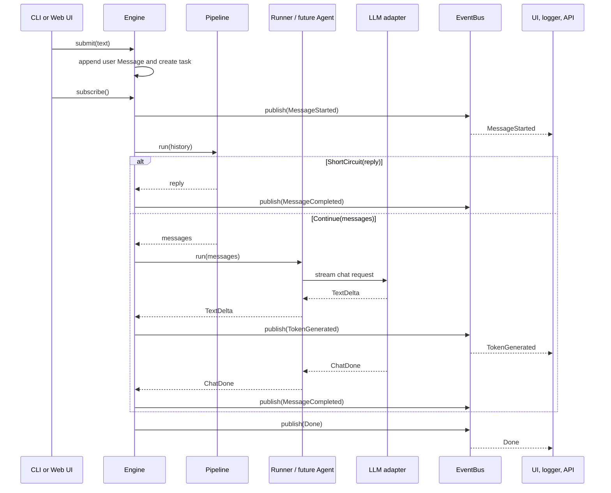

# Engine and Event Bus

`Engine` is the public entry point for Sensai front-ends. A CLI, a web UI, or
another output consumer interacts with the core through two operations:

- `engine.submit(text)`: start processing one user message;
- `engine.subscribe()`: receive the public events produced while it is being
  processed.

A front-end must not import or call the pipeline, the runner, an agent, or an
LLM adapter directly.

## Components

### Engine

`Engine` coordinates one submitted message. It owns the in-memory conversation
history and the asynchronous task for the active submission.

It receives three dependencies through its constructor:

- a `Pipeline`, which processes the current history before generation;
- a `Runner`, which streams low-level LLM events when generation is needed;
- an `EventBus`, which distributes public events to front-ends.

The current engine accepts only one active submission. Calling `submit()` while
a task is active raises `SubmissionInProgressError`. This avoids concurrent
tasks reading or appending to the same conversation history.

### Pipeline

The pipeline is a synchronous sequence of stages. Each stage receives the
conversation history and returns either:

- `Continue(messages)`: generation should continue with the returned messages;
- `ShortCircuit(reply)`: a stage already produced the assistant reply.

A short-circuit lets features such as a semantic cache or a guardrail reply
without invoking the model.

### Runner

`Runner` is a small internal protocol implemented later by the agent layer. It
streams model-level `ChatEvent` values for a prepared conversation. Its
important distinction from the public event stream is:

- runner events describe what the model emitted, such as `TextDelta` and
  `ChatDone`;
- public events describe what a front-end should render, such as
  `TokenGenerated` and `MessageCompleted`.

The engine translates runner events. For each `TextDelta`, it appends the text
to the in-progress reply and publishes a `TokenGenerated` event. When the
runner ends, it creates one complete assistant `Message` from the accumulated
text.

### Event Bus and Subscribers

`EventBus` is an asynchronous broadcast mechanism. Every call to `subscribe()`
creates a separate `asyncio.Queue` and returns an async generator draining that
queue.

When the engine calls `await bus.publish(event)`, the bus puts the same event
into every active subscriber queue. This is broadcast behavior: one consumer
does not remove an event from another consumer's stream.

For example, the CLI and a logger can both receive the same token:

```python
cli_events = engine.subscribe()
log_events = engine.subscribe()

submission_id = engine.submit("Explain event buses")

# Both consumers later receive TokenGenerated(submission_id, ...).
```

A subscriber should close its generator with `await events.aclose()` when it no
longer needs events. The bus then removes its queue in `_drain()`'s `finally`
block.

## Request Flow



`subscribe()` should normally be called before `submit()` so the front-end does
not miss the first `MessageStarted` event.

## Public Event Contract

All consumers receive the same `Event` union:

```python
Event = (
    MessageStarted
    | TokenGenerated
    | MessageCompleted
    | ErrorEvent
    | Done
)
```

Every event includes `submission_id`. A front-end uses it to associate events
with the request that caused them.

| Event | Meaning |
| --- | --- |
| `MessageStarted` | Processing has started. |
| `TokenGenerated` | A new text fragment is available during streaming. |
| `MessageCompleted` | A complete assistant `Message` has been produced. |
| `ErrorEvent` | Processing failed with a `SensaiError`. |
| `Done` | The submission task has finished and will produce no more events. |

`Done` is always published from the engine's `finally` block. Consumers can use
it as the terminal signal, including after an error or interruption.

## Error Handling and Interruption

The engine catches `SensaiError` and publishes it in `ErrorEvent`. Unexpected
exceptions are wrapped in `EngineError` before they are published. The engine
then publishes `Done` in both cases.

`engine.interrupt(submission_id)` cancels the task associated with an active
submission. Cancellation stops the task at its next asynchronous suspension
point, usually while the runner is waiting for more model output. The task is
removed from the engine and `Done` is still published by the `finally` block.

Interruption currently has no dedicated public event. A future branching and
interrupt feature may add an `Interrupted` event to the `Event` union.

## Ownership Boundaries

The separation is deliberate:

- front-ends use `Engine` and its event stream only;
- the engine coordinates workflow and translates low-level generation events;
- the pipeline decides whether generation continues or short-circuits;
- the runner or future agent performs generation through core ports;
- the event bus distributes output but does not decide what the output means;
- adapters translate infrastructure protocols such as Ollama or HTTP and must
  not appear in core signatures.

This keeps the CLI, a future Web UI, logging, and observability consumers
independent from the agent implementation.
